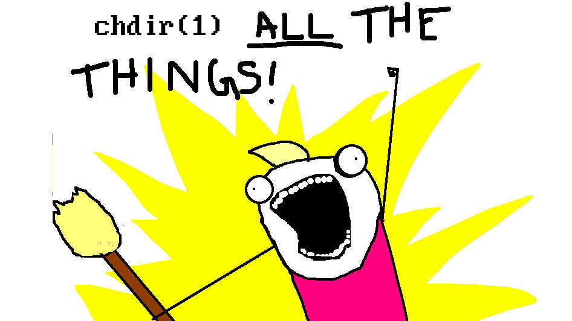

chdir(1) ALL THE THINGS
=======================
This script tries to take the concept of changing directory, but overloads the directory changing with a couple of handy features.

Examples
--------
`c path/to/directory` chdir into a directory, remove old directory if empty, list the contents.

`c ..` chdir to parent directory, remove directory if empty, list contents of parent directory.

`c path/to/file` chdir into the same directory as the file is contained, list the contents.

`c file.zip` create a folder with the basename of the compressed archive, remove the archive, cd into it, and list the contents.

`c file.tar.gz` create a folder with the basename of the compressed archive, remove the archive, cd into it, and list the contents.

`c file1.zip file2.zip file3.zip` decompress the multiple archives into separate folders, do not chdir into them. 

`c tmp` create a temporary folder with a temporary name, using first letters as unique in the folder such that they are easy to tab, secondary, add date, third, add three random words from dictonary (somtimes NSFW!) so folder can be easily remembered by a human. Eg. `a_tmp_2025-10-23_19-33-21_intercom-gazebo-repetitious`

`c my folder` create a new folder with all arguments treated as one directory name, cd into it.

`c https://github.com/arnognulf/dotfiles` do a shallow clone of git repository, chdir into it, and list the contents.

