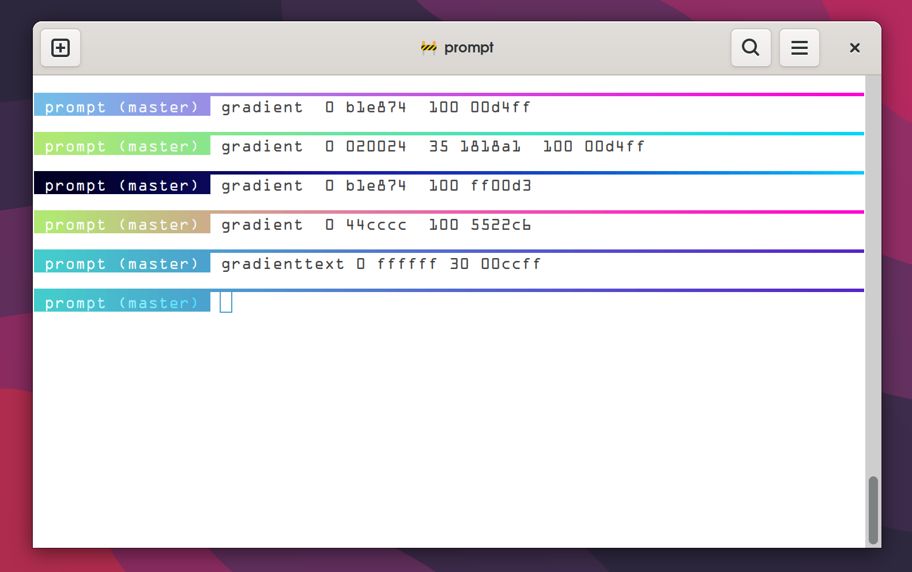
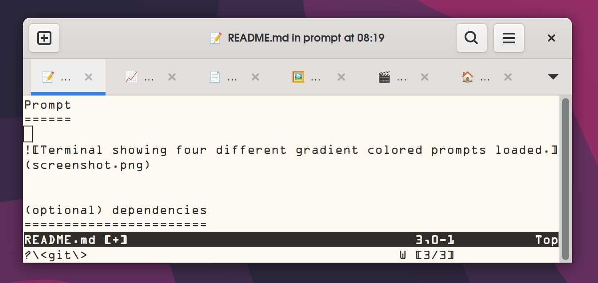
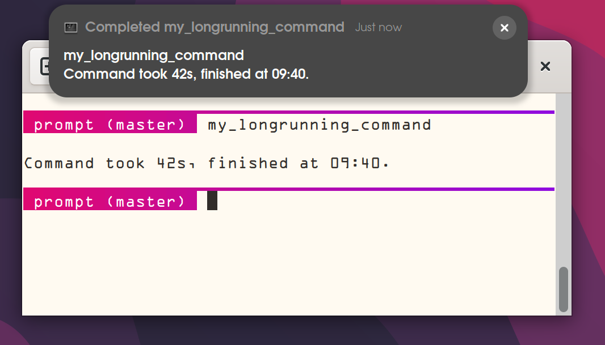

🚝 Monorail Prompt
==================



Monorail is a simple and beautiful shell prompt with customizable gradient colors.

Install
=======

```
mkdir -p ~/.config/
cd ~/.config

git clone https://github.com/arnognulf/monorail

```

Add the following line to ~/.bashrc or ~/.zshrc

```
. ~/.config/monorail/prompt.sh
```

Changing colors
===============
Run `bgcolor` to change background
```
bgcolor fffaf1
```

Run `fgcolor` to change foreground
```
fgcolor 444444
```

Run `gradient` to change prompt gradient:
```
gradient  0 b1e874  100 00d4ff
```
The `gradient` command has a simple syntax which gives an easy translation of gradients from https://cssgradient.io/ and https://uigradients.com.

Run `gradienttext` to change prompt gradient text:
```
gradienttext  0 ffffff  100 444444
```


Favicon titles
==============


Use an emoji in the title as a favicon so the context of the terminal tab can be easily visualized even if the full text is not shown.


Different folders have their own icons, being in a git folder shows the construction icon for instance.


Icons can be added to apps with aliases:

```
alias vim="_ICON 📝 vim"
```

Timing statistics
=================


By default, long-running commands (> 30s) are measured and will emit a popup notification and audible beep when finished.

To disable statistics for a command, create an alias with the `_NO_MEASURE` function as follows:

```
alias top='_NO_MEASURE _ICON 📈 top'
```

Supported shells
================
Tested on bash 5.2 and zsh 5.9

Supported terminals
===================
gradient colors are availible on truecolor terminals
see https://github.com/termstandard/colors for a comprehensive list of supported terminal status.


Notably, Mac OS X Terminal does not support truecolor.


FAQ
===
Q: Gradient turns grey or disappears mid-line/mid-text, why?


A: The gradient look-up-table may be malformed. Verify that all elements have three parameters in the range of 0-255, separated by semicolons ';', eg. "64;29;128".

Credits
=======
Oklab: A perceptual color space for image processing: https://bottosson.github.io/posts/oklab/

How to calculate color contrast: https://www.leserlich.info/werkzeuge/kontrastrechner/index-en.php


`bc(1)` helper functions: http://phodd.net/gnu-bc/code/logic.bc


bash-preexec which enables timing statistics: https://github.com/rcaloras/bash-preexec


https://github.com/termstandard/colors


StackExchange discussion on how to differentiate if user pressed ENTER or entered a command: https://unix.stackexchange.com/questions/226909/tell-if-last-command-was-empty-in-prompt-command


